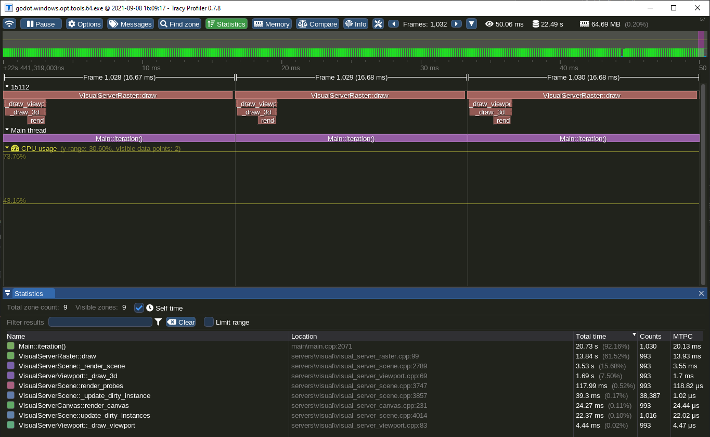
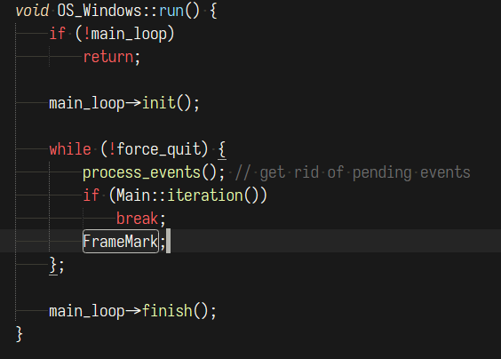
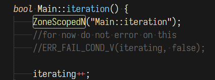

# GodotTracy
[Tracy Profiler](https://github.com/wolfpld/tracy) module for the [Godot Engine](https://github.com/godotengine/godot)

`git clone --recurse-submodules https://github.com/Pineapple/GodotTracy.git`

Copy `godot_tracy` folder to modules folder in Godot sources.

Add `module_godot_tracy_enabled=true` to your SCons command to build with Tracy enabled.

Get Tracy documentation and profiler binary from [releases page](https://github.com/wolfpld/tracy/releases/).

## Example how to add Tracy instrumentation in Godot

In every file where you call Tracy functions add `#include "modules/godot_tracy/profiler.h"`

Add `FrameMark;` in platform specific loop to mark the boundaries of the frames. On Windows it's inside `OS_Windows::run()` in `platform/windows/os_windows.cpp`

Add `ZoneScopedN("Text visible in Tracy");` inside the functions you want to profile in Tracy.

